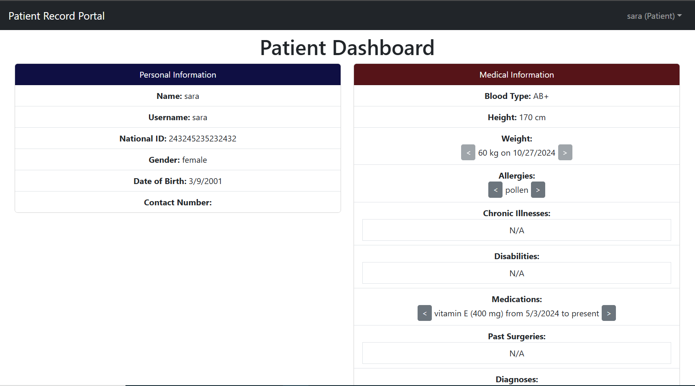
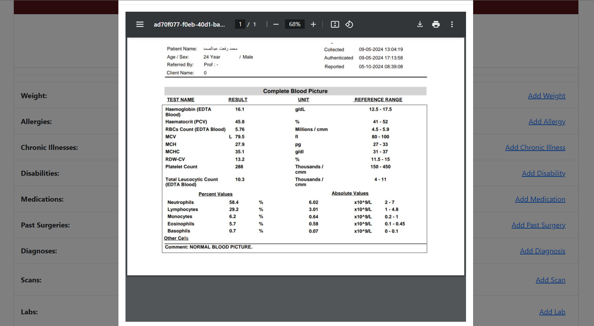
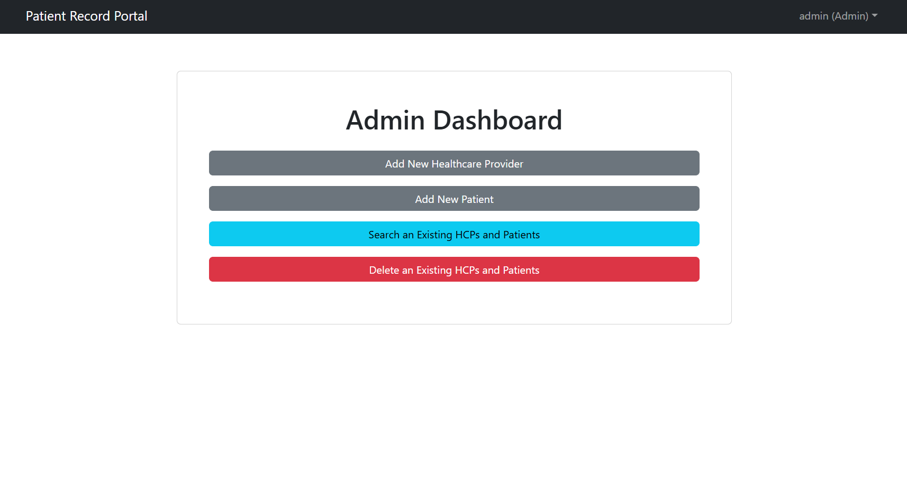

# Patient Record Portal

## Description
Patient Record Portal is a comprehensive and secure platform built using the MERN stack, designed to manage patient records efficiently. to add, update, and view patient information, ensuring seamless and accurate record-keeping.

## Screenshoots




## Features
- **Role-based authorization**:
  - **Admin**: Create, search, and delete healthcare providers and patients.
  - **HCP**: Add and view medical records of patients.
  - **Patient**: View medical records.
- **Medical Data Entry**: Add various medical data such as blood-type, diagnoses, medications, past surgeries, weight, scans, lab results, etc...
- **File Uploading and Viewing Capabilities**

## API documentation
[API Postman doc Link ](https://documenter.getpostman.com/view/36369414/2sAXxWYU74)

## Technologies Used
- **Backend**: Node.js, Express, Postman
- **Database**: MongoDB (Atlas)
- **Database Modeling**: Mongoose
- **Frontend**: React, vite
- **libraries**: jwt, Redux-toolkit, multer, etc...
  
## Installation
1. **Clone the repository**:
   ```bash
   git clone https://github.com/Mohammed-Refat-0/Patient_Record_Portal
2. **Navigate to the project directory**:
   ```bash
   cd patient-record-portal
3. **Create a .env file in the project root directory and populate it with the following environment variables**:
   ```bash
   NODE_ENV=production
   PORT=5000 
   MONGODB_URI=<your-mongodb-atlas-uri>
   JWT_SECRET=<your-secret>
4. **Install dependencies**:
   ```bash
   npm install
5. **Build frontend static files from the frontend directory **
   ```bash
   cd fronted
   npm install
   npm run build
5. **run the program**:
   ```bash
   cd ..
   npm run server
   
## License
MIT License

## Author
Mohammed Refat
